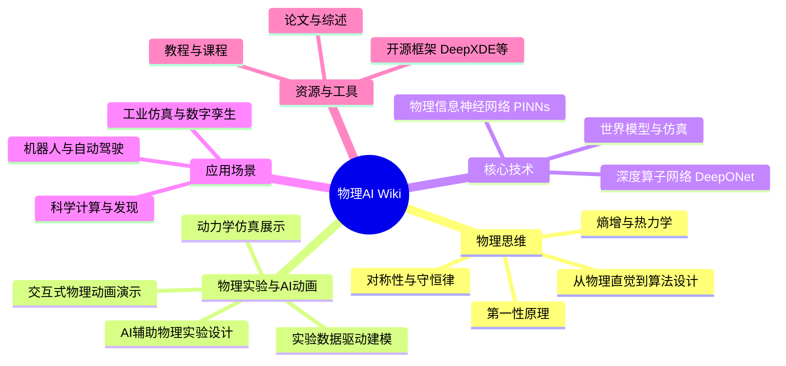

# 🧠 物理 AI Wiki
欢迎来到物理AI知识库。以下思维导图展示了本知识库的完整架构与核心脉络

```mermaid
mindmap
  root((物理AI Wiki))
    物理思维
      第一性原理
      对称性与守恒律
      熵增与热力学
      从物理直觉到算法设计
    物理实验与AI动画
      动力学仿真展示
      实验数据驱动建模
      AI辅助物理实验设计
      交互式物理动画演示
    核心技术
      物理信息神经网络 PINNs
      深度算子网络 DeepONet
      世界模型与仿真
    应用场景
      机器人与自动驾驶
      工业仿真与数字孪生
      科学计算与发现
    资源与工具
      开源框架 DeepXDE等
      论文与综述
      教程与课程
```
联系与反馈
如果你在使用过程中遇到问题，或者有好的实验想法，欢迎通过以下方式联系我：

📝 提交 Issue/建议：点击这里去 GitHub 提交
